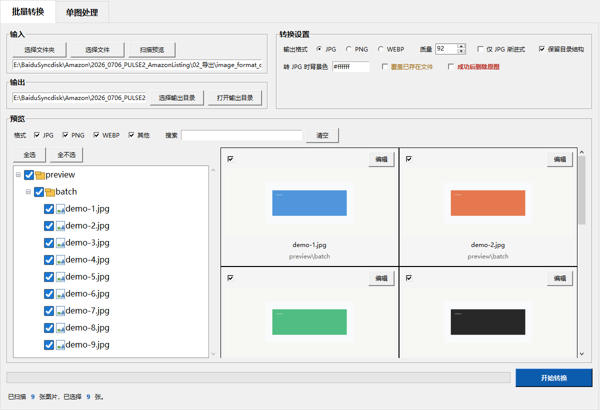

# 图片格式转换工具 1.3


一个面向素材处理场景的 Windows 桌面工具，支持批量图片格式转换、目录树勾选预览、单图裁剪编辑，以及 EXE 打包分享。

## 界面预览



## 主要功能

- 批量输入：选择文件夹或多个图片文件。
- 支持输入格式：JPG、JPEG、PNG、WEBP、BMP、TIFF。
- 支持输出格式：JPG、PNG、WEBP。
- 批量筛选：按 JPG / PNG / WEBP / 其他格式筛选。
- 模糊搜索：按文件名或相对路径搜索图片。
- 目录树选择：左侧勾选什么，右侧预览就显示什么。
- 保留目录结构：转换后可保持原始文件夹层级。
- 单图处理：裁剪、缩放、旋转、比例预设、吸附、撤销/重做、保存副本。
- 打包发布：可用 PyInstaller 打包成 EXE，分享给没有 Python 环境的用户。

## 1.3 更新

- 取消鼠标悬停大图预览，改为点击卡片弹出居中预览窗口，解决预览区抖动。
- 批量卡片保留常驻 `编辑` 按钮，双击缩略图仍进入单图处理。
- 状态栏中的扫描、选择、进度、成功/失败等数字改为蓝色加粗。
- 单图处理页支持直接按 `Ctrl+V` 粘贴图片或图片路径。
- 单图工具栏按编辑、对齐、比例分组，对齐按钮改为更明确的图标样式。
- 单图裁剪选区外增加半透明黑色遮罩，裁剪区域更清晰。

## 1.2 更新

- 强化主按钮视觉层级：批量“开始转换”和单图“保存副本”更醒目。
- 单图编辑新增 `当前裁剪` 尺寸，拖动裁剪框或使用比例预设时实时更新。
- 批量预览卡片瘦身，`编辑` 和 `大图预览` 改为鼠标悬停时显示。
- 加固 JPG 专属控件联动：非 JPG 输出时禁用背景色和渐进式 JPG 设置。
- README 更新 v1.2 界面截图，并继续保留历史版本标签。

## 1.1 更新

- 批量输入改为“选择文件夹 / 选择文件”两个直接按钮，减少操作步骤。
- 批量卡片操作改为“编辑”和“大图预览”，语义更清楚。
- 单图处理页删除重复导出入口，保存副本、覆盖原图、打开结果统一放到底部。
- `仅 JPG 渐进式` 和 `转 JPG 时背景色` 只在 JPG 输出时启用，避免格式概念混淆。
- “覆盖已存在文件”“成功后删除原图”增加视觉警示，删除原图仍保留二次确认。
- 支持从剪贴板读取图片，截图后可直接进入单图处理。
- 批量转换完成后，如果存在失败项，会弹出失败列表并写入报告。
- 增加基础快捷键：`Enter` 开始批量转换，`Ctrl+S` 保存单图副本，`R` 重置单图编辑，`Esc` 关闭悬停预览。

## 版本备份

- `v1.0.0`、`v1.1.0`、`v1.2.0`、`v1.3.0` 保留为 Git 标签。
- 本地保留源码备份压缩包，例如：`version_backups/image_converter_v1.3.0_source_backup.zip`。
- `version_backups/` 只作为本地备份目录，不推送到 GitHub。

## 运行脚本版

推荐双击：

```text
启动图片格式转换工具_无黑窗.vbs
```

备用入口：

```text
启动图片格式转换工具.bat
```

如果直接运行 Python：

```powershell
python image_converter_gui.py
```

## 打包 EXE

项目已验证可用 PyInstaller 打包：

```powershell
python -m PyInstaller --noconsole --name 图片格式转换工具 --distpath dist --workpath build --specpath . image_converter_gui.py
```

打包后会生成：

```text
dist/
└─ 图片格式转换工具/
   ├─ 图片格式转换工具.exe
   └─ _internal/
```

分享给别人时，请发送整个 `图片格式转换工具` 文件夹，或压缩成 zip 后发送。不要只单独发送 `.exe`，因为 `_internal` 是运行依赖。

## 注意事项

- `仅 JPG 渐进式` 只对 JPG/JPEG 输出有效，默认不勾选。
- 转换重要素材时，首次使用不建议勾选“成功后删除原图”。
- 输出目录建议放在输入目录旁边，避免输出结果被再次扫描。
- 单图编辑默认保存副本，覆盖原图前会二次确认。

## 开发知识库

项目开发过程、技术栈说明、踩坑复盘和可复用模板见：

```text
图片格式转换工具_1.0_开发知识库.html
```
