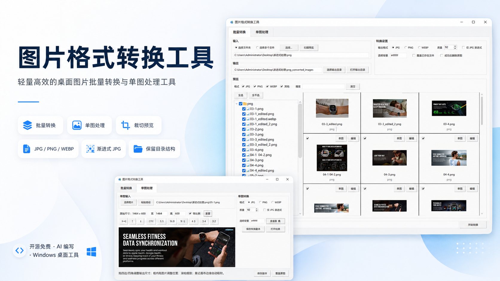
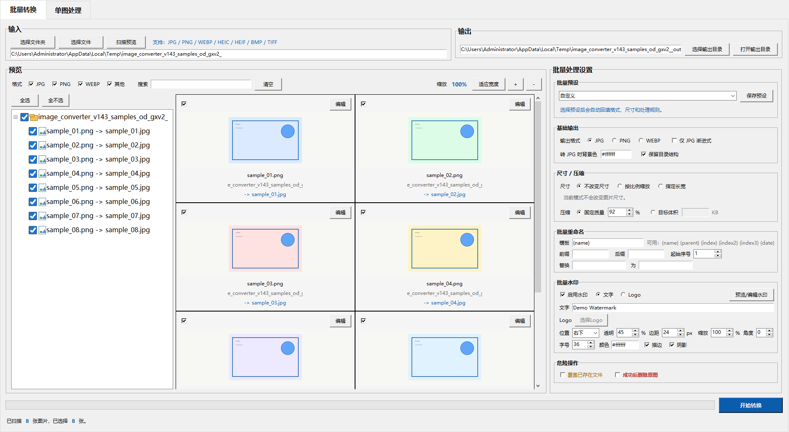

# 图片格式转换工具 1.4.6



一个面向素材处理场景的 Windows 桌面工具，支持批量图片格式转换、Amazon 尺寸预设、HEIC 输入转换、智能压缩、批量重命名、基础水印、目录树勾选预览、单图裁剪编辑，以及 EXE 打包分享。

## 界面预览



## 主要功能

- 批量输入：选择文件夹或多个图片文件。
- 支持输入格式：JPG、JPEG、PNG、WEBP、BMP、TIFF、HEIC/HEIF（需要 HEIC 支持库）。
- 支持输出格式：JPG、PNG、WEBP。
- 批量预设：内置 Amazon 主图 `1600 x 1600`、A+ 桌面图 `1464 x 600`、移动 A+ `1500 x 1125`、WebP 网页图等方案，并支持保存自定义预设。
- 尺寸调整：支持不改变尺寸、按比例缩放、指定长宽，并支持拉伸、等比留白、等比裁剪。
- 智能压缩：支持固定质量和目标体积两种互斥模式；JPG / WEBP 可按目标体积自动试算质量，PNG 使用无损 optimize。
- 批量重命名：支持模板、前缀、后缀、序号、父文件夹名、日期和查找替换。
- 批量水印：支持文字水印和图片 Logo，支持九宫格位置、透明度、边距、文字字号、颜色、描边和阴影。
- 水印预览：可按输出尺寸预览水印，拖动调整位置、缩放、不透明度和角度。
- 批量筛选：按 JPG / PNG / WEBP / 其他格式筛选。
- 模糊搜索：按文件名或相对路径搜索图片。
- 目录树选择：左侧勾选什么，右侧预览就显示什么。
- 保留目录结构：转换后可保持原始文件夹层级。
- 单图处理：裁剪、缩放、旋转、比例预设、吸附、撤销/重做、保存副本。
- 打包发布：可用 PyInstaller 打包成 EXE，分享给没有 Python 环境的用户。

## 1.4.6 更新

- 批量页升级为真正的自动化工作流：用 `WorkflowModule` 驱动右侧流程卡片，用 `ProcessingStep` 驱动执行进度。
- 当前处理流程只显示已启用模块，并按固定顺序展示：格式与输出、尺寸与压缩、批量重命名、批量水印。
- 流程卡片支持点击后展开对应参数模块，参数模块标题实时显示当前摘要，避免静态说明和实际设置不一致。
- 参数区改为折叠面板，默认只展开格式与输出，未启用模块内部控件保持禁用。
- 转换进度改为按处理步骤计算，底部固定显示当前文件、当前步骤和总进度。
- 单张图片失败不会中断整批任务，失败图片会在卡片中标记，并可点击查看错误原因。
- 文件树只显示源文件名，输出信息集中到预览卡片，减少左侧信息噪音。
- 保持单次读取、内存处理、单次保存的转换路径，避免中间文件造成质量损失。

## 1.4.5 更新

- 产品定位从“批量转换 / 单图处理”调整为“批量自动化 / 图片编辑”，更贴合图片生产工作台方向。
- 右侧设置区标题升级为“自动化工作流”，顶部新增“当前处理流程”摘要。
- 处理流程摘要实时显示格式转换、尺寸 / 压缩、重命名、水印和任务统计，方便转换前快速确认。
- 保留现有三栏结构和所有批量处理能力，不引入切图、拼图等新模块。
- 继续修正默认布局，确保底部状态、进度条和开始转换按钮可见。

## 1.4.3 更新

- 修复同名不同格式图片转同一格式时的目标文件冲突，自动追加源扩展名区分。
- 扫描阶段提前检测无法自动解决的目标冲突，并禁用 `开始转换`。
- 批量设置区去掉滚动条，增大字号和间距，减少拥挤。
- 预览区新增缩放控制，支持放大、缩小和适应宽度。
- 批量水印新增 `预览/编辑水印` 窗口，支持按输出尺寸预览、拖动位置、缩放、不透明度和角度。

## 1.4.2 更新

- 批量页改为顶部紧凑输入/输出、中部左预览右设置、底部固定主按钮，预览区更大。
- HEIC 支持说明移动到输入区附近，不再单独占用设置版块。
- `开始转换` 主按钮固定在底部，设置侧栏滚动时也始终可见。
- 尺寸调整按模式切换控件：不改变尺寸、按百分比缩放、指定长宽分别显示对应输入。
- 预设选择后显示摘要，明确反馈输出格式、尺寸规则和压缩方式。
- 水印文字和 Logo 控件分行展示，文字输入框加宽，并按水印类型精确启用/禁用。

## 1.4.1 更新

- 按批量处理思维导图重构设置区，拆分为批量预设、HEIC 支持、基础输出、尺寸调整、智能压缩、批量重命名、批量水印和危险操作。
- Amazon 内置预设显示并套用具体尺寸：主图 `1600 x 1600`、A+ 桌面图 `1464 x 600`、移动 A+ `1500 x 1125`。
- 新增批量尺寸调整，支持不改变尺寸、按比例缩放、指定长宽、拉伸、等比留白和等比裁剪。
- HEIC/HEIF 输入转换正式启用，安装 `pillow-heif` 后可转换为 JPG / PNG / WEBP。
- 压缩改为固定质量 / 目标体积互斥模式，减少质量和目标体积同时出现造成的理解冲突。
- 水印未启用时相关控件自动置灰；文字水印增加字号、颜色、描边和阴影。
- 左侧目录树显示 `原文件名 -> 新文件名`，更方便转换前检查重命名结果。
- 修复切换输出格式后筛选、搜索和已勾选状态丢失的问题。

## 1.4 更新

- 新增批量处理预设，下拉选择即可套用常用输出方案，并可保存自定义预设到本地。
- 新增 HEIC/HEIF 输入识别；安装 HEIC 支持库后可转 JPG / PNG / WEBP，未安装时会给出明确提示。
- 新增 JPG / WEBP 目标体积压缩，例如 `200KB`、`500KB`、`1.5MB`。
- 新增批量重命名规则，支持 `{name}`、`{parent}`、`{index}`、`{index2}`、`{index3}`、`{date}` 和查找替换。
- 新增批量文字水印 / Logo 水印，支持九宫格位置、透明度和边距。
- 转换报告增加原文件大小和输出文件大小，方便检查压缩效果。

## 1.3.4 更新

- 裁剪框外遮罩改为 Pillow 生成的真实半透明图层，不再使用 Canvas 点阵遮罩。
- 框外区域更暗、更平滑，框内图片保持正常亮度。

## 1.3.3 更新

- 加深单图编辑裁剪框外遮罩，让保留区域和丢弃区域区分更明显。

## 1.3.2 更新

- 单图编辑对齐按钮改为 Pillow 绘制图标，不再依赖 Unicode 字符渲染。
- 修复部分 Windows 字体下对齐图标显示变形的问题。

## 1.3.1 更新

- 优化单图编辑的对齐图标，更接近设计软件的左右/居中/上下对齐视觉。
- 拖动图片时，图片边缘靠近绿色裁剪框边缘也会自动吸附。

## 1.3 更新

- 取消鼠标悬停大图预览，改为点击卡片弹出居中预览窗口，解决预览区抖动。
- 批量卡片保留常驻 `编辑` 按钮，双击缩略图仍进入单图处理。
- 状态栏中的扫描、选择、进度、成功/失败等数字改为蓝色加粗。
- 单图处理页支持直接按 `Ctrl+V` 粘贴图片或图片路径。
- 单图工具栏按编辑、对齐、比例分组，对齐按钮改为更明确的图标样式。
- 单图裁剪选区外增加半透明黑色遮罩，裁剪区域更清晰。

## 1.2 更新

- 强化主按钮视觉层级：批量“开始转换”和单图“保存副本”更醒目。
- 单图编辑新增 `当前裁剪` 尺寸，拖动裁剪框或使用比例预设时实时更新。
- 批量预览卡片瘦身，`编辑` 和 `大图预览` 改为鼠标悬停时显示。
- 加固 JPG 专属控件联动：非 JPG 输出时禁用背景色和渐进式 JPG 设置。
- README 更新 v1.2 界面截图，并继续保留历史版本标签。

## 1.1 更新

- 批量输入改为“选择文件夹 / 选择文件”两个直接按钮，减少操作步骤。
- 批量卡片操作改为“编辑”和“大图预览”，语义更清楚。
- 单图处理页删除重复导出入口，保存副本、覆盖原图、打开结果统一放到底部。
- `仅 JPG 渐进式` 和 `转 JPG 时背景色` 只在 JPG 输出时启用，避免格式概念混淆。
- “覆盖已存在文件”“成功后删除原图”增加视觉警示，删除原图仍保留二次确认。
- 支持从剪贴板读取图片，截图后可直接进入单图处理。
- 批量转换完成后，如果存在失败项，会弹出失败列表并写入报告。
- 增加基础快捷键：`Enter` 开始批量转换，`Ctrl+S` 保存单图副本，`R` 重置单图编辑，`Esc` 关闭悬停预览。

## HEIC 支持说明

HEIC/HEIF 作为输入格式需要额外支持库。脚本版可安装：

```powershell
python -m pip install pillow-heif
```

未安装时，工具仍可正常处理 JPG / PNG / WEBP / BMP / TIFF；HEIC 文件会显示无法预览，并在转换报告中写明原因。v1.4.5 EXE 版已在打包环境安装 `pillow-heif`，可直接读取 HEIC/HEIF。

## 版本备份

- `v1.0.0`、`v1.1.0`、`v1.2.0`、`v1.3.0`、`v1.3.1`、`v1.3.2`、`v1.3.3`、`v1.3.4`、`v1.4.0`、`v1.4.1`、`v1.4.2`、`v1.4.3`、`v1.4.4`、`v1.4.5` 保留为 Git 标签。
- 本地保留源码备份压缩包，例如：`version_backups/image_converter_v1.4.5_source_backup.zip`。
- `version_backups/` 只作为本地备份目录，不推送到 GitHub。

## 运行脚本版

推荐双击：

```text
启动图片格式转换工具_无黑窗.vbs
```

备用入口：

```text
启动图片格式转换工具.bat
```

如果直接运行 Python：

```powershell
python image_converter_gui.py
```

## 打包 EXE

项目已验证可用 PyInstaller 打包：

```powershell
python -m PyInstaller --noconsole --name 图片格式转换工具 --distpath dist --workpath build --specpath . image_converter_gui.py
```

打包后会生成：

```text
dist/
└─ 图片格式转换工具/
   ├─ 图片格式转换工具.exe
   └─ _internal/
```

分享给别人时，请发送整个 `图片格式转换工具` 文件夹，或压缩成 zip 后发送。不要只单独发送 `.exe`，因为 `_internal` 是运行依赖。

## 注意事项

- `仅 JPG 渐进式` 只对 JPG/JPEG 输出有效，默认不勾选。
- 转换重要素材时，首次使用不建议勾选“成功后删除原图”。
- 输出目录建议放在输入目录旁边，避免输出结果被再次扫描。
- 单图编辑默认保存副本，覆盖原图前会二次确认。

## 开发知识库

项目开发过程、技术栈说明、踩坑复盘和可复用模板见：

```text
图片格式转换工具_1.0_开发知识库.html
```
